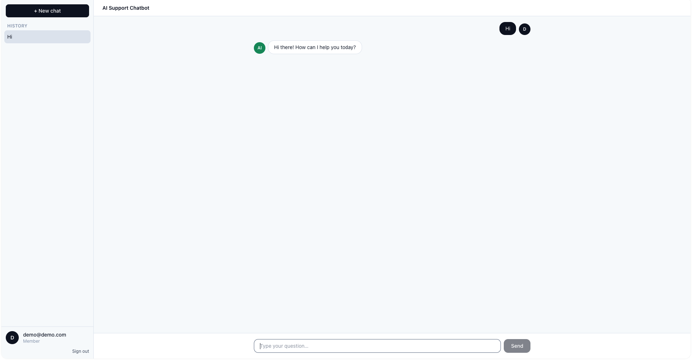
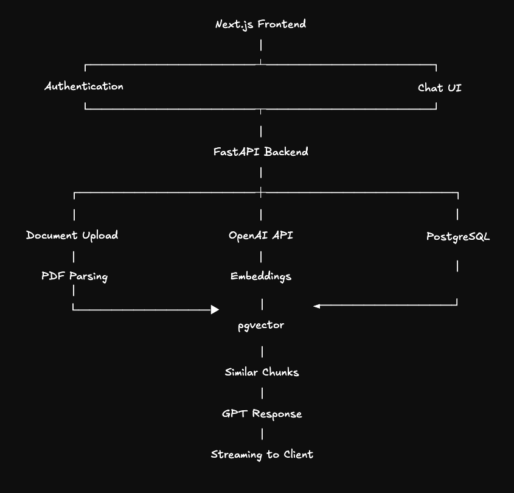

# AI Customer Support Chatbot (RAG)

A Retrieval-Augmented Generation chatbot that answers questions from your company
documentation, PDFs, and knowledge bases. It ships with conversation history,
inline source citations, streaming responses, authentication, and an admin
dashboard for uploading and managing documents.

## Screenshot



## Architecture



**Ingestion:** admin uploads a document → backend splits it into chunks →
each chunk is embedded with OpenAI → embeddings are stored in `pgvector`.

**Query:** user asks a question → question is embedded → top-k similar chunks are
retrieved via cosine similarity → chunks + chat history are passed to the LLM →
the answer streams back to the browser with citations to the source chunks.

## Tech stack
<div align="center">

| Layer        | Technology                                        |
|--------------|---------------------------------------------------|
| Frontend     | Next.js (App Router), React, TypeScript, Tailwind |
| Backend      | Python, FastAPI, LangChain                        |
| LLM          | OpenAI (chat + embeddings)                        |
| Vector store | PostgreSQL + `pgvector`                           |
| Auth         | JWT (access tokens), bcrypt password hashing      |
| Deployment   | Docker + docker-compose                           |

</div>
## Quick start (Docker)

```bash
cp .env.example .env          # then fill in OPENAI_API_KEY and secrets
docker compose up --build
```

- Frontend: http://localhost:3000
- Backend API + docs: http://localhost:8000/docs
- Postgres (pgvector): localhost:5432

On first boot the backend creates its tables and seeds an admin user from
`ADMIN_EMAIL` / `ADMIN_PASSWORD` in your `.env`.

## Local development (without Docker)

### Backend

```bash
cd backend
python -m venv .venv && source .venv/bin/activate
pip install -r requirements.txt
cp .env.example .env          # point DATABASE_URL at a local pgvector-enabled Postgres
uvicorn app.main:app --reload --port 8000
```

You need a Postgres with the `vector` extension available. The quickest way is:

```bash
docker run -d --name rag-pg -p 5432:5432 \
  -e POSTGRES_PASSWORD=postgres -e POSTGRES_DB=ragbot \
  pgvector/pgvector:pg16
```

### Frontend

```bash
cd frontend
npm install
cp .env.example .env.local     # set NEXT_PUBLIC_API_URL=http://localhost:8000
npm run dev
```

## Project layout

```
.
├── backend/            FastAPI service (API, auth, RAG pipeline)
│   └── app/
│       ├── config.py       settings & environment
│       ├── database.py     SQLAlchemy engine/session
│       ├── models.py       users, conversations, documents, chunks
│       ├── security.py     JWT + bcrypt helpers
│       ├── rag/            ingestion, embeddings, retrieval, answer chain
│       │   ├── ingest.py
│       │   ├── embeddings.py
│       │   ├── retriever.py
│       │   └── chain.py
│       └── routers/        auth, chat (SSE streaming), documents
├── frontend/           Next.js app (App Router)
│   ├── app/            pages: chat, login, admin dashboard
│   ├── components/     Chat, Sidebar, AuthProvider
│   └── lib/            API client
├── bridge/             Kubernetes manifests (kustomize base + desktop overlay)
├── docs/               README images (screenshot, architecture)
├── docker-compose.yml  postgres + backend + frontend
└── .env.example        shared environment template
```

## Testing

The backend has a pytest suite covering auth and the full RAG flow. It runs in
offline `fake` mode (no API keys) against an isolated `ragbot_test` database, so it
never touches real data. With the stack running (`docker compose up`):

```bash
docker compose run --rm --no-deps -v "$PWD/backend:/app" \
  backend sh -c "pip install -r requirements-dev.txt && pytest"
```

Or locally from `backend/` (with a pgvector Postgres available):

```bash
pip install -r requirements-dev.txt
pytest
```

## API overview
<table align="center">
  <thead>
    <tr>
      <th>Method</th>
      <th>Path</th>
      <th>Auth</th>
      <th>Description</th>
    </tr>
  </thead>
  <tbody>
    <tr>
      <td><code>POST</code></td>
      <td><code>/api/auth/register</code></td>
      <td>–</td>
      <td>Create a user</td>
    </tr>
    <tr>
      <td><code>POST</code></td>
      <td><code>/api/auth/login</code></td>
      <td>–</td>
      <td>Get a JWT access token</td>
    </tr>
    <tr>
      <td><code>GET</code></td>
      <td><code>/api/auth/me</code></td>
      <td>user</td>
      <td>Current user</td>
    </tr>
    <tr>
      <td><code>POST</code></td>
      <td><code>/api/chat</code></td>
      <td>user</td>
      <td>Ask a question (SSE streaming reply)</td>
    </tr>
    <tr>
      <td><code>GET</code></td>
      <td><code>/api/chat/conversations</code></td>
      <td>user</td>
      <td>List past conversations</td>
    </tr>
    <tr>
      <td><code>GET</code></td>
      <td><code>/api/documents</code></td>
      <td>admin</td>
      <td>List uploaded documents</td>
    </tr>
    <tr>
      <td><code>POST</code></td>
      <td><code>/api/documents</code></td>
      <td>admin</td>
      <td>Upload and ingest a document</td>
    </tr>
    <tr>
      <td><code>DELETE</code></td>
      <td><code>/api/documents/{id}</code></td>
      <td>admin</td>
      <td>Remove a document and its chunks</td>
    </tr>
  </tbody>
</table>
